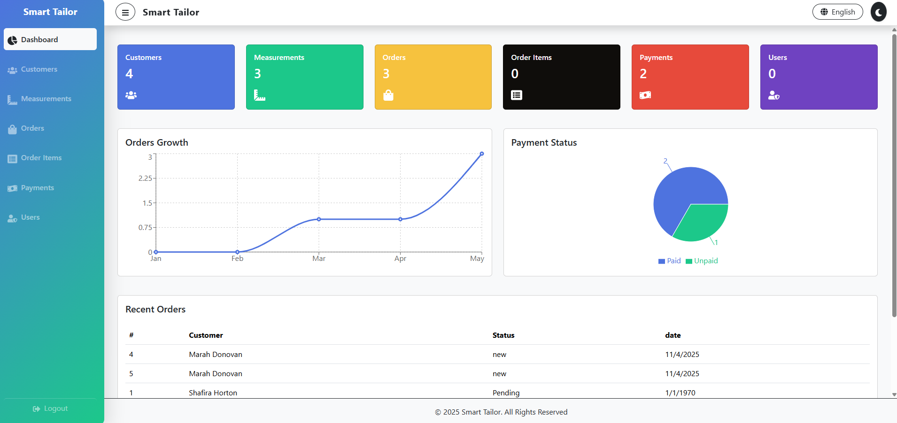
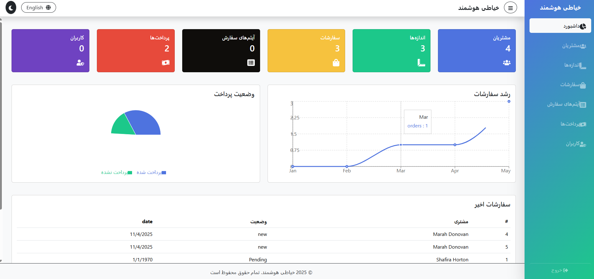
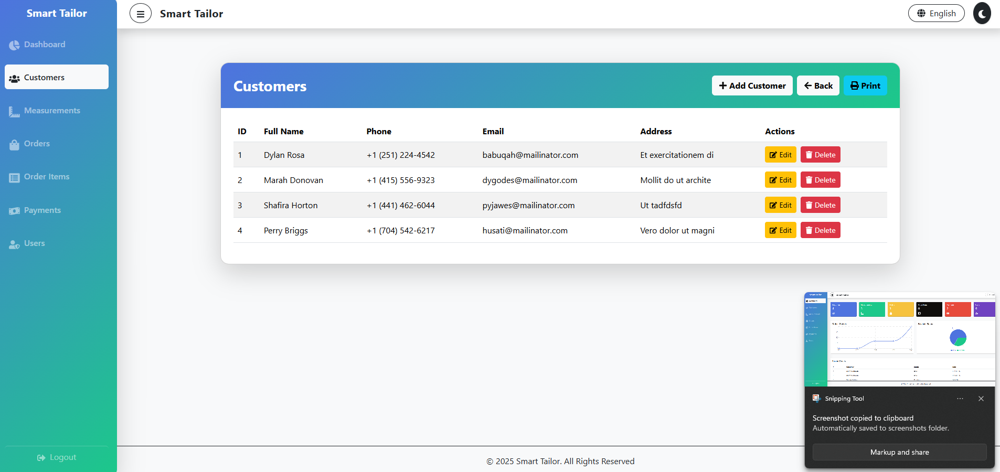
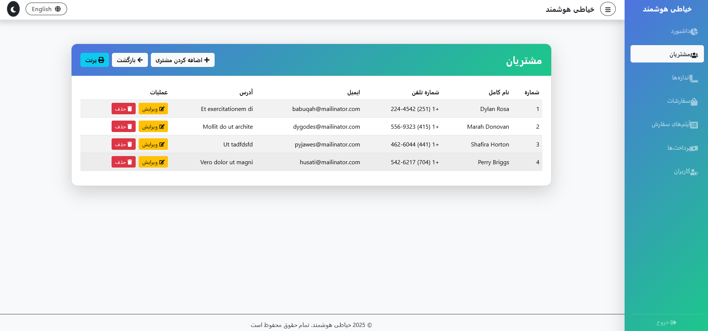
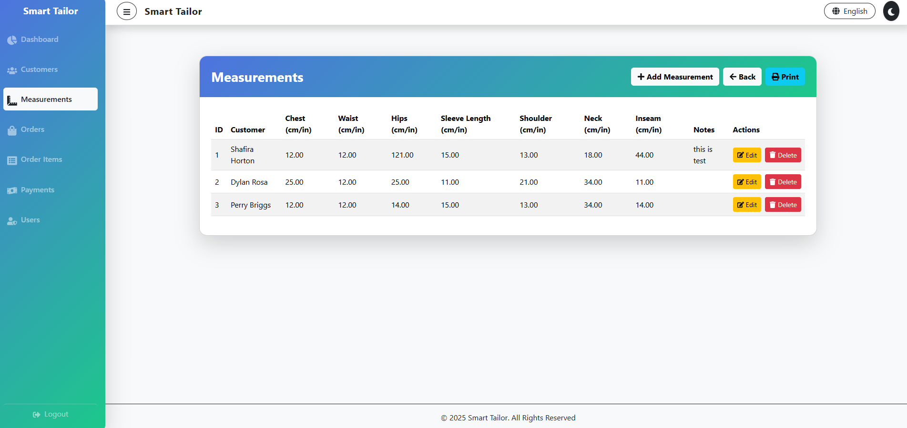

---

# Smart Tailoring Management System

A full-stack web application for managing a smart tailoring system. It includes **authentication**, **role-based access**, and **CRUD functionality** for customers, measurements, orders, payments, and users.

* **Frontend:** React.js
* **Backend:** Laravel (PHP)
* **Database:** PostgreSQL

---

## Features

* **Authentication & Authorization:**

  * Login / Logout
  * Protected routes (users must login to access dashboard)
  * Role-based access for admin users

* **CRUD Operations:**

  * Customers
  * Measurements
  * Orders & Order Items
  * Payments
  * Users (Admin-only)

* **Other Features:**

  * "Remember Me" login option
  * Responsive design with RTL support for Persian/Farsi
  * Dashboard landing page after login
  * API secured with Laravel Sanctum

---

## Tech Stack

| Layer        | Technology                                                 |
| ------------ | ---------------------------------------------------------- |
| Frontend     | React.js, React Router v6, Axios, Bootstrap 5, React Icons |
| Backend      | Laravel 10, PHP 8+, Sanctum Authentication                 |
| Database     | PostgreSQL                                                 |
| Localization | react-i18next (RTL support)                                |

---

## Screenshots

### Login Page


### Dashboard



### Dashboard RTL



### Customers List



### Customer RTL



### Measurements List



> Replace the above paths (`./screenshots/...`) with the actual screenshot paths in your project.

---

## Folder Structure

### Frontend (React)

```
src/
├── components/
│   ├── Layout/
│   ├── Customers/
│   ├── Measurements/
│   ├── OrderItems/
│   ├── Payments/
│   └── system/ (User management)
├── pages/
│   ├── Login.js
│   └── Dashboard.js
├── App.js
└── index.js
```

### Backend (Laravel)

```
app/
├── Http/
│   ├── Controllers/
│   │   ├── Api/
│   │   │   ├── AuthController.php
│   │   │   ├── CustomerController.php
│   │   │   ├── MeasurementController.php
│   │   │   ├── OrderController.php
│   │   │   ├── OrderItemController.php
│   │   │   ├── PaymentController.php
│   │   │   └── UserController.php
routes/
├── api.php
├── web.php
database/
├── migrations/
└── seeders/
```

---

## Installation

### Backend (Laravel)

1. Clone the repository:

```bash
git clone https://github.com/Azimuddin-Arab/Smart-Tailorign-System.git
cd smart-tailoring/backend
```

2. Install dependencies:

```bash
composer install
```

3. Configure `.env` for PostgreSQL:

```env
DB_CONNECTION=pgsql
DB_HOST=127.0.0.1
DB_PORT=5432
DB_DATABASE=tailoring_db
DB_USERNAME=your_db_user
DB_PASSWORD=your_db_password
```

4. Generate app key:

```bash
php artisan key:generate
```

5. Run migrations and seeders:

```bash
php artisan migrate --seed
```

6. Serve the backend:

```bash
php artisan serve
```

### Frontend (React)

1. Navigate to frontend folder:

```bash
cd ../frontend
```

2. Install dependencies:

```bash
npm install
```

3. Start the development server:

```bash
npm start
```

App runs on [http://localhost:3000](http://localhost:3000)

---

## Usage

1. Open the app in your browser.
2. The **Login page** appears first.
3. Enter valid credentials and click **Login**.
4. On successful login, users are redirected to the **Dashboard**.
5. Navigation sidebar allows access to CRUD pages.
6. Admin users have access to **User management**.

---

## API Endpoints

* **Authentication**

  * POST `/api/login` – login user
  * POST `/api/register` – register new user (optional)
  * POST `/api/logout` – logout

* **CRUD**

  * `/api/students`
  * `/api/customers`
  * `/api/measurements`
  * `/api/orders`
  * `/api/order-items`
  * `/api/payments`
  * `/api/users` (admin only)

> All routes except `/login` are protected with Laravel Sanctum.

---

## Notes

* **Protected Routes:** React frontend redirects unauthorized users to login page.
* **Token Storage:** JWT or Sanctum token stored in `localStorage` under `token`.
* **Role-based Access:** `user.role === "admin"` controls access to user management.
* **Remember Me:** Option to remember email in `localStorage`.

---

## License

MIT License

---
